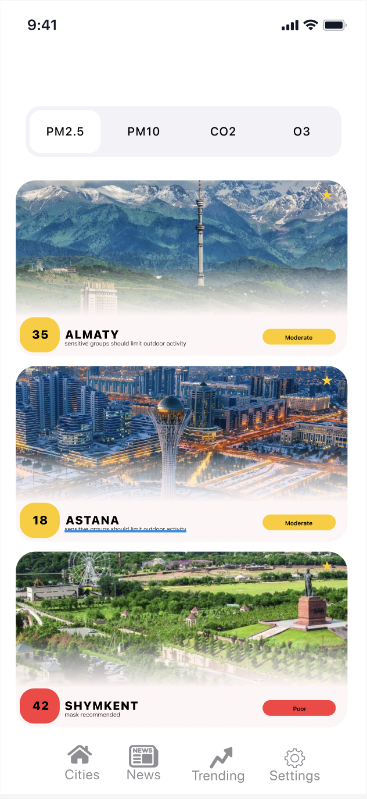
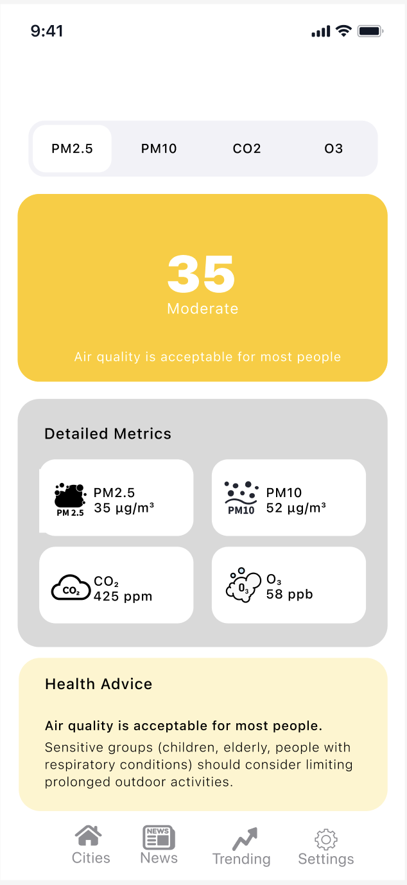
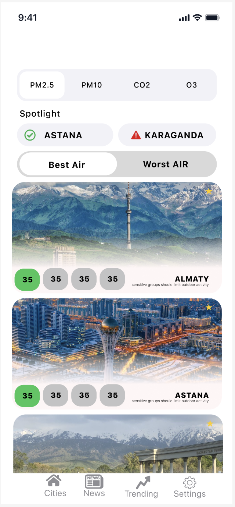
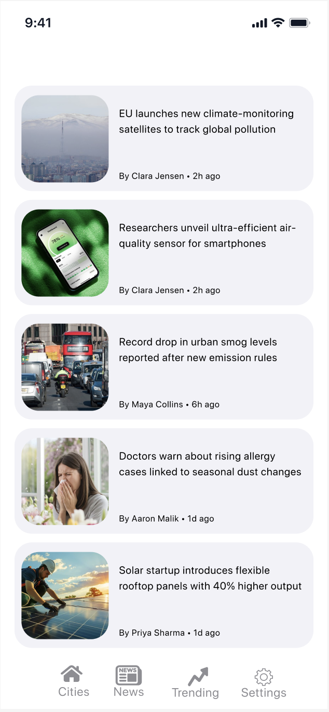

<div align="center">


# Aeris

**iOS app for tracking air quality in Kazakhstan cities — with trends, details, and related news.**

[Features](#features) •
[Tech Stack](#tech-stack) •
[Getting Started](#getting-started) •
[Configuration](#configuration) •
[Project Structure](#project-structure)

</div>

---

## Features

- **Cities list** (Kazakhstan cities) with quick air quality preview  
- **City details** with **metric switching** (e.g., AQI / PM2.5 / PM10 / CO2) via segmented control  
- **Trending** screen to compare / browse hotspots  
- **News feed** about air pollution with built‑in article viewer  
- **Settings**: default metric + notifications toggle (stored in `UserDefaults`)  
- Lightweight in‑memory caching for air quality requests

---

## Screens

<div align="center">
  
  
  
  
</div>


---

## Tech Stack

- **Swift + UIKit** (Storyboards)
- **URLSession** networking
- **Swift Package Manager** dependencies:
  - [Kingfisher](https://github.com/onevcat/Kingfisher) — image downloading & caching (used for news images)

---

## Getting Started

### Prerequisites

- **Xcode** (project targets **iOS 18.5+**)
- An **OpenWeather API key** (used for Air Pollution endpoints)

### Run the app

1. Clone the repository and open the Xcode project:
   - `Aeris/Aeris.xcodeproj`
2. Configure your API key (see below).
3. Select a simulator/device and **Run** (⌘R).

---

## Configuration

### 1) OpenWeather API key (required)

Air quality requests use an API key read from an environment variable:

```swift
private let apiKey: String = ProcessInfo.processInfo.environment["API_KEY"] ?? ""
```

In **Xcode**:
1. **Product → Scheme → Edit Scheme…**
2. **Run → Arguments → Environment Variables**
3. Add:
   - `API_KEY` = `<your_openweather_api_key>`

> ⚠️ Do not commit API keys to GitHub.

### 2) News API backend (optional)

News requests go to a hosted backend:

- `https://air-api-8lb9.onrender.com/news/air-pollution`

You can change this in:

- `Aeris/Aeris/Core/Services/NewsAPIService.swift`

If the endpoint is unavailable, the News screen may show an error / empty state.

---

## Data Sources

- **OpenWeather Air Pollution API**  
  Used to fetch AQI and pollutant components by latitude/longitude.

- **Air pollution news backend (Render)**  
  Aggregates news articles and returns a simplified JSON feed for the app.

---

## Project Structure

```
Aeris/
├─ Aeris.xcodeproj
└─ Aeris/
   ├─ Application/     # App bootstrap / app-wide setup
   ├─ Core/            # Models, Services, shared utilities
   ├─ Features/        # Screens (Cities, Trending, News, Settings, Onboarding)
   └─ Resources/       # Storyboards, Assets.xcassets
```

---

## Troubleshooting

- **Air quality is always empty / 401 error**  
  Make sure `API_KEY` is set in the Run scheme environment variables.

- **News doesn’t load**  
  Check your internet connection and verify the backend URL in `NewsAPIService.swift`.

- **Images don’t appear**  
  Kingfisher is included via SPM; if packages fail to resolve, try:  
  **File → Packages → Reset Package Caches** (then rebuild).

---

## Team

- Artur Kultyshev — Air Quality module  
- Zhumatay Sayana — News module

---

## Notes

This is an **educational project**. If you plan to distribute the app, consider moving secrets out of environment variables and into a safer configuration approach (e.g., build settings + `.xcconfig` excluded from git, or a server-side token proxy).

